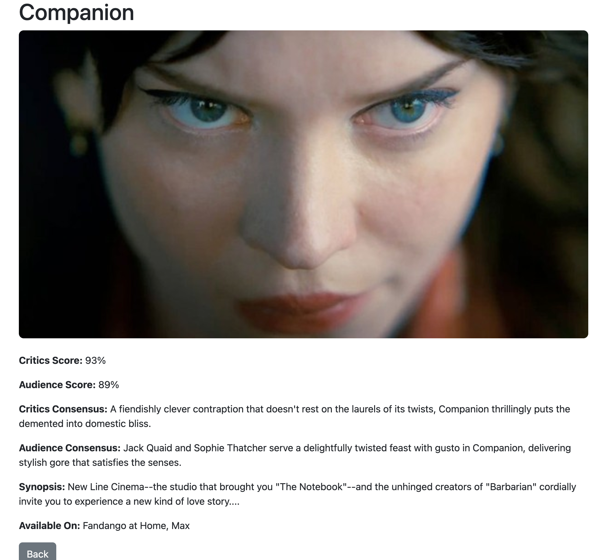

# 🍅 Rotten Tomatoes Scraper

A Flask-based web application that scrapes popular movies and TV shows from Rotten Tomatoes and displays them in a user-friendly UI. Each movie or show links to a detailed page with critic and audience scores, synopsis, consensus, and available streaming platforms.

## 🚀 Features

- 🔍 Scrapes real-time data from Rotten Tomatoes (Movies & Shows)
- 🎥 Clickable cards link to detailed pages for each title
- 🍿 Shows critic/audience scores and synopsis
- 🧠 Displays critic and audience consensus (when available)
- 📺 Lists platforms where each title can be streamed
- 📁 Export movieor show data to CSV
- 💡 Responsive Bootstrap UI for a clean layout

## 📸 Screenshots



## 🛠️ Tech Stack

- Python 3
- Flask
- BeautifulSoup (bs4)
- HTML/CSS (with Bootstrap)

## 🧪 How to Run Locally

1. **Clone this repo**
   ```bash
   git clone https://github.com/EricKenji/what-to-stream.git
   cd rotten-tomatoes-scraper
   ```
   
2. **Create a virtual environment and install dependencies**
   ```bash
    python -m venv venv
    source venv/bin/activate 
    pip install -r requirements.txt
   ```
   
3. **Run the Flask app**
   ```bash
    python app.py
   ```
   
3. **Run the Flask app**
   ```bash
    http://127.0.0.1:5000/
   ```
   
## ⚠️ Disclaimer
This project is for educational purposes only. Rotten Tomatoes content is the property of Fandango Media, LLC. Use responsibly and avoid excessive scraping.